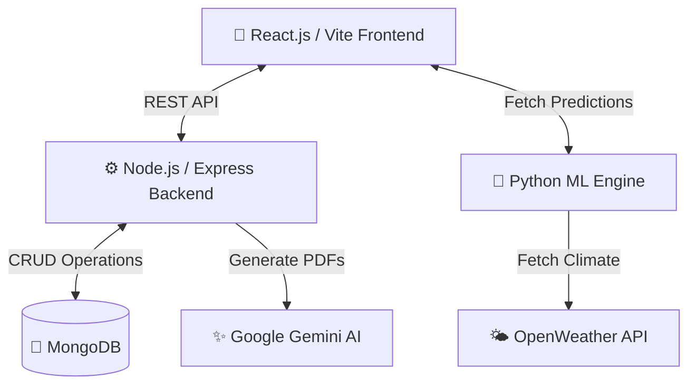
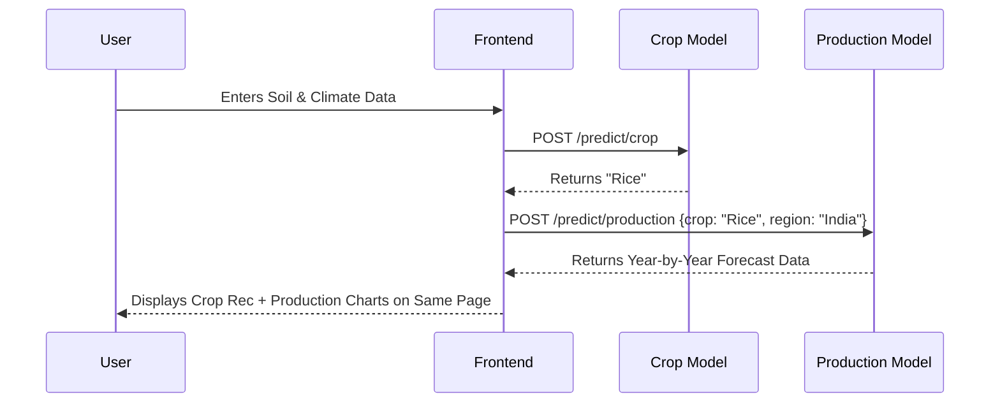

# 🌱 AgroAI - AI-Powered Agricultural Platform

A comprehensive full-stack application designed to empower farmers with AI-driven insights, weather forecasts, local logistics, and crop management tools. Built with the MERN stack (MongoDB, Express, React, Node.js), powered by Google's Gemini AI, and driven by a robust Python Machine Learning engine.

## 🚀 Features

* **Triple Machine Learning Engine:** Suggests optimal crops based on soil and weather, displays year-by-year historical Indian crop production projections, and recommends precise nutrient additions based on soil health.
* **Local Transport Marketplace:** An integrated logistics finder connecting farmers with nearby transport vehicles to ship their yield without middlemen.
* **Smart Soil Health Reports:** Generates detailed, downloadable PDF reports analyzing soil health using **Google Gemini AI**.
* **Real-time Weather Updates:** Live weather forecasting using the **OpenWeather API** to help farmers plan their activities.
* **Interactive Dashboard:** Visual analytics and charts (using **Recharts**) for production trends and yield analysis.
* **Community & User Profiles:** Secure authentication system with profile management and image uploads (using **Cloudinary**).

## 📊 System Architecture & Data Flow

AgroAI utilizes a microservice-inspired architecture separating the client interface, data backend, and predictive ML engine.



### Prediction Flow

When a farmer inputs their soil data, the system triggers a chained prediction flow:



## 🧠 Machine Learning Technical Details

The predictive engine uses Random Forest Classification and Regression to handle agricultural optimization.

While standard Decision Trees are prone to overfitting, Random Forest constructs an ensemble of independent trees ($B$). Each tree is trained on a bootstrap sample with feature subspace sampling. The final prediction $\hat{Y}$ is determined by taking the majority vote across all generated trees:

$$\hat{Y} = \operatorname{mode} \{ T_1(x), T_2(x), \dots, T_B(x) \}$$

This ensures high accuracy (>95%) and resilience against localized anomalies (like erratic micro-climate readings) when processing features like Nitrogen (N), Phosphorus (P), Potassium (K), pH, temperature, humidity, and rainfall.

## 🛠️ Tech Stack

### Frontend
* **Framework:** React.js (Vite)
* **Language:** TypeScript
* **Styling:** Tailwind CSS, Shadcn UI
* **Visualizations:** Recharts, Framer Motion

### Backend
* **Runtime:** Node.js
* **Framework:** Express.js
* **Database:** MongoDB (Mongoose)
* **AI Integration:** Google Gemini API (@google/generative-ai)
* **PDF Generation:** PDFKit

### Machine Learning
* **Language:** Python
* **Libraries:** Scikit-Learn, Pandas, NumPy
* **Models:** Random Forest (Crop & Fertilizer), Time-Series/Regression (Indian Crop Production)

## 📂 Project Structure

```text
├── client/          # React Frontend application
│   ├── src/
│   └── package.json
├── server/          # Node.js/Express Backend
│   ├── controllers/
│   ├── routes/
│   └── package.json
└── ml-engine/       # Python Machine Learning API
    ├── models/      # .pkl files for Crop, Fertilizer, Production
    ├── app.py       # Flask/FastAPI server
    └── requirements.txt
```

## 🔧 Installation & Setup

**Prerequisites:** Node.js (v18+), Python (3.9+), MongoDB Atlas Account, Cloudinary API Key, Google Gemini API Key, and OpenWeather API Key.

### 1. Clone the Repository

```bash
git clone https://github.com/animeshtripathii/AgroAI.git
cd AgroAI
```

### 2. Backend Setup

```bash
cd server
npm install
```

Create a `.env` file in the server directory:

```env
PORT=5000
MONGO_URI=your_mongodb_connection_string
JWT_SECRET=your_jwt_secret_key
GEMINI_API_KEY=your_gemini_api_key
CLOUDINARY_CLOUD_NAME=your_cloud_name
CLOUDINARY_API_KEY=your_cloudinary_key
CLOUDINARY_API_SECRET=your_cloudinary_secret
```

```bash
npm run dev
```

### 3. Machine Learning Setup

```bash
cd ../ml-engine
pip install -r requirements.txt
python app.py
```

### 4. Frontend Setup

```bash
cd ../client
npm install
```

Create a `.env` file in the client directory:

```env
VITE_API_BASE_URL=http://localhost:5000/api
VITE_ML_API_URL=http://127.0.0.1:8000
VITE_OPENWEATHER_API_KEY=your_openweather_key
```

```bash
npm run dev
```

## 🚀 Deployment (Render)

The entire application suite is configured for cloud deployment on Render.

* **Database:** Host your MongoDB cluster on MongoDB Atlas.
* **Backend (Node.js):** Create a new "Web Service" on Render. Point it to the server directory. Use `npm install` for the build command and `npm start` for the start command.
* **ML Engine (Python):** Create a second "Web Service" on Render. Point it to the ml-engine directory. Use `pip install -r requirements.txt` and `gunicorn app:app` (or Uvicorn if using FastAPI).
* **Frontend (React):** Create a "Static Site" on Render. Point it to the client directory. Use `npm run build` as the build command and `dist` as the publish directory. Ensure you map the production URLs for your Node and ML endpoints in the Render environment variables.

## 🤝 Contributing

Contributions are welcome! Please fork the repository and submit a pull request for any enhancements or bug fixes.

## 📄 License

This project is licensed under the MIT License.
